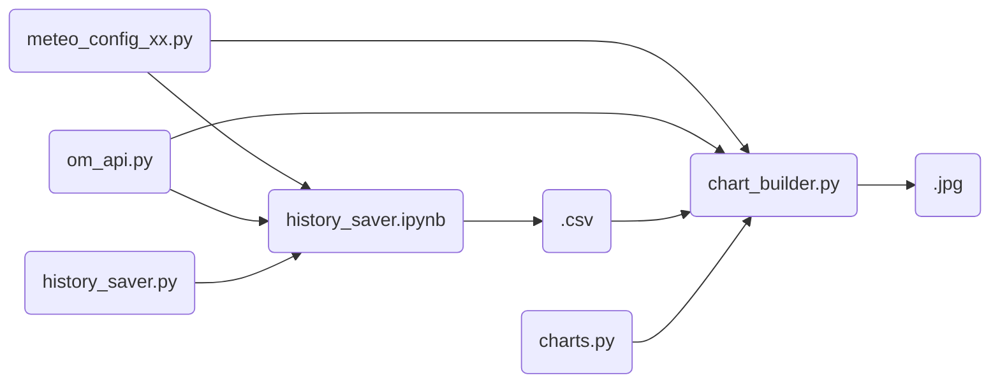
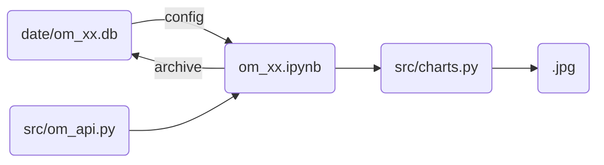

## version 1.0

### 项目结构

### 版本特点

- 通过 `meteo_config_xx.py` 文件记录配置信息，例如：
  - 样本点经纬度
  - 国家、城市名称
  - 数据加工过程
  - 绘图样式等
- 历史数据会以城市维度汇总后存储在 `.csv` 文件中
- 历史数据的管理依赖手工管理
- 需要手工调整所需的时间周期
  - （周）每次运行大约需要占用 5 min
  - （月）每次整理历史数据需占用 10 min
  - 合计年度占用 360 min

## version 2.0

### 项目结构

- 所有信息都存储在 `data/om_xx.db` 文件中：
  - 历史天气数据 `archive`
  - 国家、城市名称 `cities`
  - 样本点经纬度信息 `locations`
  - 绘图样式 `charts`
- 历史数据以样本点维度存储在 `.db` 文件中
  - 该文件为 `sqlite` 数据库文件
  - 可以通过随附的 `data/DB.Browser.for.SQLite.msi` 读取
- 完成初次的数据下载后，后续无需手工管理数据
  - （周）每次运行大约需要占用 1 min
  - 无需整理历史数据
  - 合计年度占用 50 min
