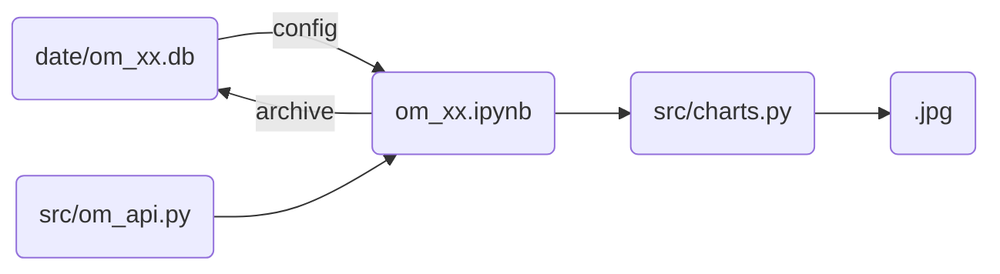

# 基础信息

## 项目文件结构

- `v02` 文件根目录
  - `chart` 图表保存一级路径
    - `us` 图表保存二级路径
  - `data` 用于存储数据
    - `om_xx.db` 数据，格式 SQLite
    - `om_xx.py` 数据读写配套代码
  - `src` 可以复用的资源包
    - `date_process.py` 通用的日期加工方法
    - `plt_charts.py` 通用的绘图方法
    - `om_api.py` 通用的 API 请求方法
  - `om_xx.ipynb` 具体代码


## 项目依赖关系




# 搭建教程

## 数据库搭建

> - ⚠️ 因采用「主键」作为数据唯一标识，建议采用「关系型数据库」作为数据存储的技术
> - ⚠️ 若采用 excel 或 csv 存储数据，需要注意数据唯一性问题
> - 🟢 本案例采用 sqlite 为例，可以采用其他数据库技术

### 数据库创建

- 可以采用 `DB Browser for SQLite` 等软件
- 建议以分析主题命名数据库
  - 以 `om_palm.db` 为例
  - `om` 代表数据来源为 _Open Meteo_
  - `palm` 代表分析主题为油棕

### 历史数据表 `archive`

#### 表结构说明

- **数据库列**
  - 通用列
  - `location_code` 样本点代码，类型为文本
  - `date` 日期，类型为文本
  - 个性化列
  - `temperature_2m_mean` 平均温度，类型为浮点数
  - `precipitation_sum` 总降水量，类型为浮点数
  - 按实际需要创建
- **数据库键**
  - 将 `location_code` 和 `date` 设为联合主键
  - 冲突解决办法设为替代 `replace`

#### 示例建表语句

``` sqlite
CREATE TABLE "archive"
(
    location_code                TEXT,
    date                         TEXT,
    temperature_2m_mean          REAL,
    precipitation_sum            REAL,
    soil_moisture_7_to_28cm_mean REAL,
    constraint archive_pk
        primary key (location_code, date) on conflict replace
)
```
### 样本点经纬度信息 `locations`

#### 表结构说明

- `location_code` 样本点代码，类型为文本
- `city_code` 隶属城市代码，类型为文本
- `latitude` 纬度，类型为浮点数
- `longitude` 经度，类型为浮点数

#### 示例建表语句

```sqlite
CREATE TABLE "locations"
(
    latitude      REAL,
    longitude     REAL,
    city_code     TEXT,
    location_code TEXT
)
```

### 图表样式信息 `charts`

#### 表结构说明

- `variable` 数据列名，类型为文本
- `y_label` y轴标签名，类型为文本
- `title` 标题名，类型为文本
- `min_history_year` 最小历史年份，类型为整数型

#### 示例建表语句

```sqlite
CREATE TABLE charts
(
    variable         TEXT,
    y_label          TEXT,
    title            TEXT,
    min_history_year INT
)
```

### 汇总信息 `cities`

#### 表结构说明

- `country` 国家名，类型为文本
- `city` 城市名，类型为文本
- `code` 城市代码，类型为文本

#### 示例建表语句

```sqlite
CREATE TABLE "cities"
(
    country TEXT,
    city TEXT,
    code TEXT)
```

## 数据库配套程序

```python

# 修改成实际数据库名称
db_path = os.path.join(script_dir, 'om_xx.db')

# 修改成实际需要获取的指标名称
variables = ['temperature_2m_mean', 'precipitation_sum', 'soil_moisture_7_to_28cm_mean']

# 数据加工通用方法按照实际需要修改
def data_process(archive_df, forecast_df=None):
  pass
```

## 数据初始化

- 将所需的历史数据保存到数据库中
- 要注意单次请求允许的时间长度（建议控制在 1～2 年）
- 建议至少存储历史十年的数据

```python
from data import om_xx
om_xx._save_archive('2015-01-01', '2024-12-31')
```

## 日常使用

```python
from data import om_xx
import src.plt_charts as charts
import matplotlib.pyplot as plt

# 将自动请求数据库「最后日期-3」至「今天」的数据，并存入数据库中
print('历史数据入库')
om_xx.save_archive()

print('读取历史数据')
archive_df = om_xx.read_archive()

# 可以忽略
print('获取预测数据')
forecast_df = om_xx.get_forecast(archive_df['date'].max())

print('数据加工')
process_df = om_xx.data_process(archive_df, forecast_df)

print('绘制图表')
cities_df = om_xx.read_cities()
charts_df = om_xx.read_charts()
forecast_after = archive_df['date'].max()
for i in cities_df.index:
    # 城市参数
    country = cities_df.loc[i]['country']
    city = cities_df.loc[i]['city']
    tag = cities_df.loc[i]['tag']
    code = cities_df.loc[i]['code']
    df = process_df[ process_df['city_code'] == code ].copy()
    for j in charts_df.index:
        params = {
            'min_history_year': charts_df.loc[j]['min_history_year'],
            'forecast_after':forecast_after,
            'ylabel': charts_df.loc[j]['y_label'],
            'title': charts_df.loc[j]['title'] + city + ', ' + country + ' ' + tag
        }
        chart = charts.day_annul_plot(df, charts_df.loc[j]['variable'], **params)
        # 路径按需
        path = f'./charts/xx/{i:02d}_{code}_{j:02d}_{charts_df.loc[j]['variable']}.jpg'
        chart.savefig(path, dpi=300)
        plt.close()

print('合成大图')
file_lists = []
for i in cities_df.index:
    code = cities_df.loc[i]['code']
    for j in charts_df.index:
        # 与上保持一致
        path = f'./charts/us/{i:02d}_{code}_{j:02d}_{charts_df.loc[j]['variable']}.jpg'
        file_lists.append(path)
charts.merge2grid(file_lists, cities_df.shape[0], charts_df.shape[0], './charts/xx/merge_xx.jpg')


```